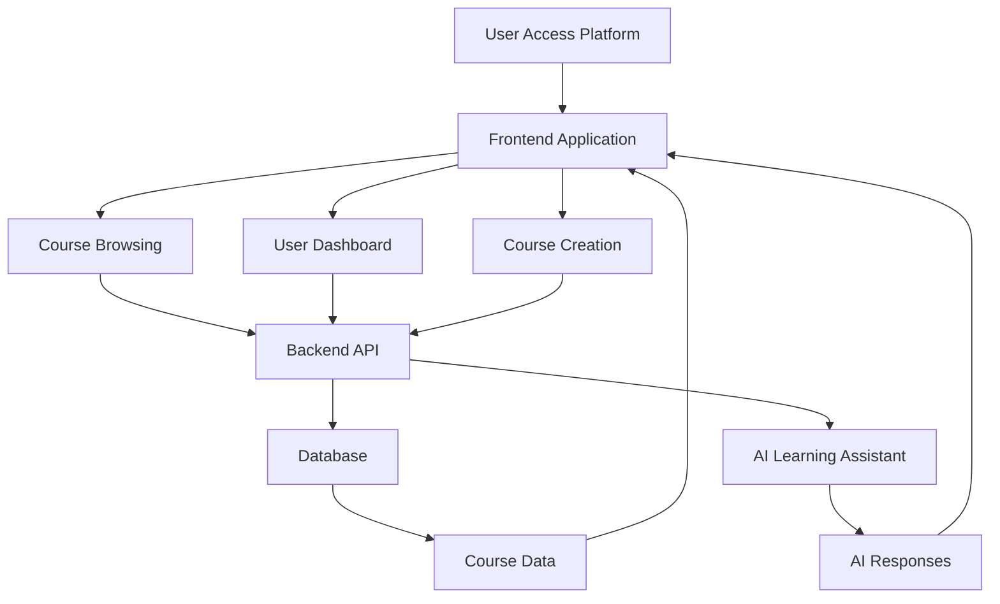

# 🎓 LearnAI — AI-Powered LMS SaaS Platform

### Scalable Learning Management System with AI-Enhanced Learning

**LearnAI** is a modern **AI-powered Learning Management System (LMS) SaaS platform** designed to deliver an intelligent online learning experience. It combines **course management, subscription-based access, AI learning assistants, and cloud deployment** to create a fully scalable educational platform.

Built using modern full-stack technologies, the platform enables instructors to create courses, manage content, and track student progress while providing learners with an engaging and interactive learning environment.

---

# 📖 What is LearnAI?

LearnAI is a **full-stack SaaS-based learning platform** that allows educators and institutions to create and manage digital courses while providing students with structured learning experiences.

The system supports:

* Course creation and publishing
* Student enrollment
* AI-powered learning support
* Subscription-based access
* Interactive dashboards
* Real-time analytics

LMS platforms like this are widely used in modern **EdTech ecosystems** to deliver scalable online learning environments and personalized educational experiences. ([Wikipedia][2])

---

# ✨ Features

| Feature                      | Description                                        |
| ---------------------------- | -------------------------------------------------- |
| 🎓 **Course Management**     | Instructors can create, update, and manage courses |
| 👨‍🎓 **Student Enrollment** | Users can browse and enroll in available courses   |
| 🤖 **AI Learning Assistant** | AI-powered help for course understanding           |
| 💳 **Subscription Model**    | SaaS-based access tiers                            |
| 📊 **Progress Tracking**     | Track course completion and learning progress      |
| 📁 **Content Upload**        | Upload videos, documents, and resources            |
| 🖥️ **Responsive Dashboard** | Student and instructor dashboards                  |
| 🔐 **Secure Authentication** | User authentication and access control             |

---

# 🏗️ System Architecture



---

# 🛠️ Technology Stack

## Frontend

| Component     | Technology              |
| ------------- | ----------------------- |
| Framework     | React / Next.js         |
| Language      | TypeScript / JavaScript |
| Styling       | Tailwind CSS            |
| UI Components | ShadCN UI               |

---

## Backend

| Component      | Technology                   |
| -------------- | ---------------------------- |
| API            | Next.js API routes / Node.js |
| Authentication | Clerk / JWT                  |
| Database       | MongoDB / PostgreSQL         |
| ORM            | Prisma / Mongoose            |

---

## DevOps

| Component       | Technology                 |
| --------------- | -------------------------- |
| Deployment      | Vercel                     |
| Version Control | Git + GitHub               |
| Payments        | Stripe (for subscriptions) |
| Storage         | Cloud storage services     |

---

# 📂 Project Structure

```text
LMS-AI-SAAS-Platform/
│
├── app/
│   ├── dashboard/
│   ├── courses/
│   ├── instructor/
│   └── api/
│
├── components/
│   ├── CourseCard.tsx
│   ├── Navbar.tsx
│   ├── Sidebar.tsx
│   └── AIChatAssistant.tsx
│
├── lib/
│   ├── database.ts
│   ├── auth.ts
│   └── ai.ts
│
├── public/
│   └── assets
│
├── prisma/
│   └── schema.prisma
│
├── package.json
└── README.md
```

---

# 🚀 Installation & Setup

## Prerequisites

* Node.js 18+
* npm / yarn
* Database (MongoDB / PostgreSQL)

---

## 1️⃣ Clone Repository

```bash
git clone https://github.com/kishorekrrish3/LMS-AI-SAAS-Platform.git
cd LMS-AI-SAAS-Platform
```

---

## 2️⃣ Install Dependencies

```bash
npm install
```

---

## 3️⃣ Configure Environment Variables

Create a `.env` file:

```env
DATABASE_URL=your_database_connection
NEXT_PUBLIC_APP_URL=http://localhost:3000
STRIPE_SECRET_KEY=your_stripe_key
AUTH_SECRET=your_auth_secret
```

---

## 4️⃣ Run Development Server

```bash
npm run dev
```

---

# 🌐 Local Development

Open:

```
http://localhost:3000
```

---

# 🎯 Core Platform Modules

| Module            | Description                       |
| ----------------- | --------------------------------- |
| Student Dashboard | Manage enrolled courses           |
| Instructor Panel  | Create and manage courses         |
| Course Player     | Video lessons and materials       |
| Progress Tracker  | Tracks learning progress          |
| AI Assistant      | Helps students with course topics |

---

# 📊 Example Platform Workflow

1️⃣ Instructor creates a course
2️⃣ Students browse available courses
3️⃣ Students enroll or purchase access
4️⃣ Course materials become accessible
5️⃣ AI assistant helps with questions
6️⃣ Progress and completion tracked

---

# 🔮 Future Improvements

* AI-generated course summaries
* AI quiz generation
* Personalized learning paths
* Instructor analytics dashboard
* Community discussion forums
* Mobile learning app

---

# 👨‍💻 Author

**Kishore P**
AI & Full-Stack Developer
CSE (AI & Robotics) — VIT Chennai

GitHub:
[https://github.com/kishorekrrish3](https://github.com/kishorekrrish3)

Portfolio:
[https://kishore-p-portfolio.vercel.app](https://kishore-p-portfolio.vercel.app)

---

<div align="center">

<br>

<i>Empowering the future of education through AI-powered learning platforms.</i>

<br><br>

**LearnAI** — scalable, intelligent, and modern digital education.

</div>

